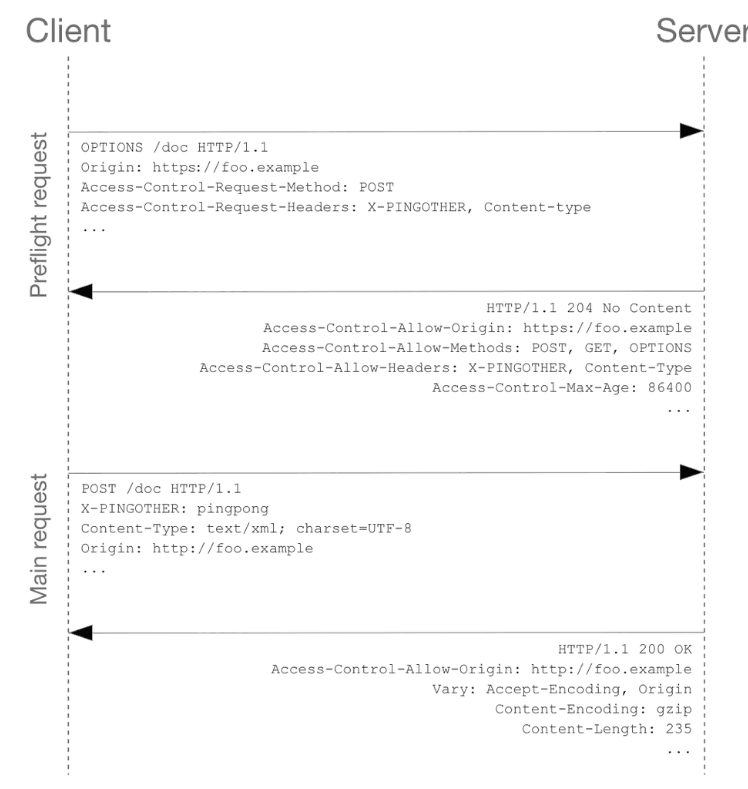

# Cross-Origin Resource Sharing ( 교차 출처 리소스 공유 )

## SOP ( Same-Origin Policy )
- 웹 생태계에는 다른 출처로의 리소스 요청을 제한하는 것과 관련된 두 가지 정책이 존재하는데, 한가지는 지금 정리하려는
  CORS , 또 한가지는 SOP 이다.
- SOP 는 지난 2011년, RFC 6454에서 처음 등장한 보안정책으로, 말 그대로 " 같은 출처에서만 리소스를 공유할 수 있다"라는 규칙을 가진 정책이다.
- 웹이라는 오픈스페이스 환경에서 다른 출처에 있는 리소스를 가져와 사용하는 일은 굉장히 흔한일이라 무작정 막을 수 없기 때문에,
몇 가지 예외 조항을 두고 이 조항에 해당하는 리소스 요청은 출처가 달라도 허용하도록 했는데 그중 하나가 **CORS 정책을 지킨 리소스 요청**이다.

## CORS 동작 시나리오 3가지
1. Simple Request
   - 일반적인 요청에 대해서는 CORS 정책 검사를 실행하지 않는데, 일반적인 요청은 다음 사항에 부합되는 요청을 의미
     1. 요청의 메서드는 GET,HEAD,POST중 하나여야함
     2. Request Header에는 다음 속성만 허용
        - Accept,Accept-Language,Content-Language,Content-Type,DPR,Downlink,Save-Data,Viewport-width,Width
     3. 만약 Content-Type 을 사용하는 경우에는 application/x-www-form-urlencoded, multipart/form-data, text/plain만 허용된다.
     4. 요청에 사용된 XMLHttpRequestUpload 객체에는 이벤트 리스너가 등록되어 있지 않다. 이들은 XMLHttpRequest.upload 프로퍼티를 사용하여 접근한다.
     5. 요청에 ReadableStream 객체가 사용되지 않는다. 
   - 이들은 일반적인 웹 어플리케이션 아키텍처를 설계하게 되면 거의 충족시키기 어려운 조건들이고, 대부분의 HTTP API 는 text/xml이나 application/json 컨텐츠 타입을 가진다. ( json은 simple Request가 아님 )
   - 애초에 저 조건에 명시된 헤더들은 기본적인 헤더들로, 복잡한 상용 웹 어플리케이션에서 이 헤더들 외에 추가적인 헤더를 사용하지 않는 경우는 드물며, 당장 인증에 사용되는 Authorization 헤더조차 포함되지 않음.
   - 추가적으로 HTTP 메서드들 중 GET 이외의 메서드나, POST 메서드에서 특정 MIME TYPE은 서버 데이터에 사이드 이펙트를 발생시킬 수 있어 기본적으로 브라우저는 Preflight Request 방식으로 요청하도록 규제
2. Preflight Request
   - 일반적으로 우리가아는 웹 애플리케이션을 개발할 때 가장 많이 마주치는 시나리오
   - 요청을 한번에 보내지 않고 예비 요청과 본 요청으로 나누어서 서버로 전송
   - Simple Request와 전반적인 로직 자체는 같고, 예비 요청의 존재 유무만 다르다
   - 접근할 리소스를 가지고 있는 서버에 Preflight Request ( 예비 요청 )을 보낸다.
   - 해당 예비 요청에는 HTTP 메서드중 OPTIONS 메서드가 사용된다. 예비 요청의 역할은 본 요청을 보내기 전에
브라우저 스스로 이 요청을 보내는 것이 안전한지 확인하는 것이다.
   - 이후 OPTIONS 요청을 받은 서버는 Response Header에 서버가 허용할 옵션을 설정하여 브라우저에게 전달
   - ex =  Access-Control-Allow-Origin 항목을 추가하여 허용할 도메인을 지정할 수 있다.
   
3. Credential Request
   - 헤더에 인증과 관련된 정보 ( 쿠키 , 세션 , 토큰 )을 담아서 보내는 요청
   - Fetch API를 사용하거나 Axios , Ajax 등을 사용할 때 서버로 쿠키를 전송해야 하는 경우가 있는데 그럴때 Credentialed Request 허용이 되어 있어야 한다.
   - Access-Control-Allow-Credentials  = true 를 보내주지 않으면 응답을 거부당하게 된다.
