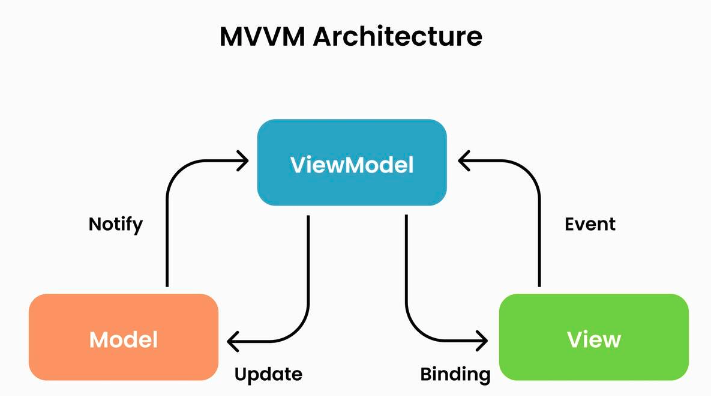

# MVVM

### MVVM Pattern
> - Model + View + View Model 를 합친 용어 
> - 프로그램의 비즈니스 로직과, 프레젠테이션 로직을 UI로 명확하게 분리하는 패턴
> 
> - Model : 어플리케이션에서 사용되는 데이터와 그 데이터를 처리하는 부분
>   - 데이터와 비즈니스 로직을 담당하는 부분
>   - 데이터를 가져오고 저장하는 역할을 수행
> - View : 사용자에서 보여지는 UI 부분, 레이아웃과 화면을 보여주는 역할
>   - 사용자 인터페이스를 담당하는 부분
>   - 사용자가 보는 화면을 표시하고, 사용자 입력을 처리한다.
> - View Model : View를 표현하기 위해 만든 View를 위한 Model입니다. View를 나타내 주기 위한 Model이자 View를 나타내기 위한 데이터 처리를 하는 부분입니다.
>   - View와 Model 사이에서 중재자 역할을 수행
>   - View에서 발생하는 이벤트를 감지하고, 해당 이벤트에 맞는 비즈니스 로직을 수행
>   - Model과 상호작용하여 데이터를 가져오거나 업데이트하고, View에 데이터를 업데이트하는 역할
>   - View에 표시할 데이터를 가공하여 제공하는 역할

### MVVM 동작

>  
> 1. 사용자의 Action들은 View를 통해 들어온다.
> 2. View에 Action이 들어오면 ViewModel에 Action을 전달
> 3. ViewModel은 Model에게 데이터를 요청
> 4. Model은 ViewModel에게 요청받은 데이터를 응답
> 5. ViewModel은 응답받은 데이터를 가공하여 저장
> 6. View는 Data Binding을 통해 UI를 갱신

### MVVM 특징
> - MVP 방식과 비슷한 부분이 많지만, MVP는 View와 Presenter 사이의 의존관계가 1:1로 형성되어 있고
> MVVM은 View와 ViewModel사이의 관계가 1:N이다.
> - 또한 데이터 바인딩을 이용한다면 View와 ViewModel 사이의 의존성을 없앨 수 있다.

### 장점
> - 뷰 로직과 비즈니스 로직을 분리하여 생산성을 높힐 수 있다. ( UI 가 나오기전부터 개발이 가능 )
> - 테스트가 수월해진다. ( 의존성이 없기 때문 )
> - 뷰와 뷰 모델이 1:N관계이기 때문에 중복되는 로직을 모듈화하여 여러 뷰에 적용이 가능하다.

### 단점
> - 설계하기 복잡하다.
> - 뷰 모델이 비대해질 수 있다.
> - 데이터 바인딩으로 인한 메모리 소모가 심하다.
> - ViewModel 설계가 복잡하다