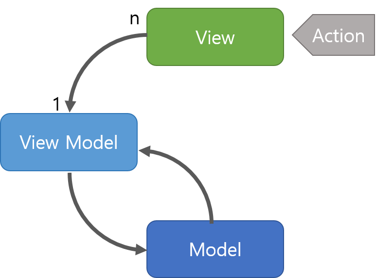

# MVVM

> - Model + View + View Model 를 합친 용어 
> 
> - Model : 어플리케이션에서 사용되는 데이터와 그 데이터를 처리하는 부분입니다.
> - View : 사용자에서 보여지는 UI 부분입니다. 
> - View Model : View를 표현하기 위해 만든 View를 위한 Model입니다. View를 나타내 주기 위한 Model이자 View를 나타내기 위한 데이터 처리를 하는 부분입니다.