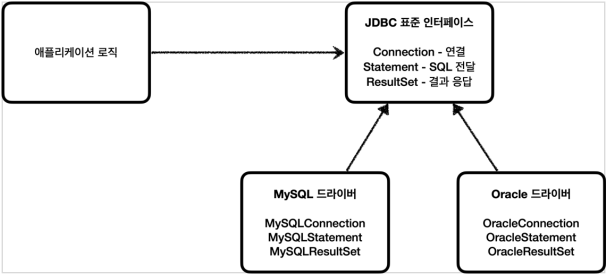
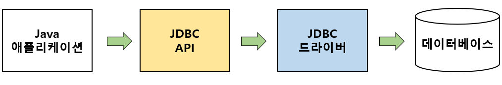
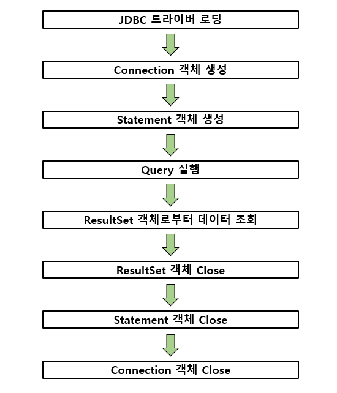

# Java Database Connectivity
> JDBC는 JAVA 기반 애플리케이션의 데이터를 데이터베이스에 저장 및 업데이트 하거나, 데이터베이스에 저장된 데이터를 JAVA에서 사용할 수 있도록 하는 자바 API
> 
> - JDBC는 3가지 기능을 표준 인터페이스로 정의하여 제공
>    - java.sql.Connection - 연결
>    - java.sql.Statement - SQL 요청을 담은 내용
>    - java.sql.ResultSet - SQL 요청에 대한 응답

- Spring Data JDBC, Spring Data JPA 등과 같은 기술이 등장하며, JDBC API를 직접적으로 사용하는 이은 많이 줄었지만,
해당 기술들도 데이터베이스와 연동하기 위해 내부적으로 JDBC를 이용하기 때문에 JDBC의 동작 흐름에 대해 알아둘 필요가 있다.

  
### JDBC의 동작 흐름

- JDBC는 Java 애플리케이션 내에서 JDBC API를 사용하여 데이터베이스에 접근하는 단순한 구조.
- JDBC API를 사용하기 위해서는 JDBC 드라이버를 먼저 로딩한 후 데이터베이스와 연결

> **JDBC 드라이버**  
> - 데이터 베이스와의 통신을 담당하는 인터페이스
> - Oracle,MS SQL,MySQL 등의 데이터베이스에 알맞은 JDBC 드라이버를 구현하여 제공
> - JDBC 드라이버의 구현체를 이용해서 특정 벤더의 데이터베이스에 접근 가능

### JDBC API 사용 흐름

1. JDBC 드라이버 로딩
   - 사용하고자 하는 JDBC 드라이버를 로딩, JDBC 드라이버는 DriverManager 클래스를 통해 로딩된다
2. Connection 객체 생성
   - JDBC 드라이버가 정상적으로 로딩되면 DriverManager를 통해 데이터베이스와 연결되는 세션 (Session)인 Connection 객체를 생성
3. Statement 객체 생성
   - Statement 객체는 작성된 SQL 쿼리문을 실행하기 위한 객체로 정적 SQL 쿼리 문자열을 입력으로 가진다.
4. Query 실행
   - 생성된 Statement 객체를 이용하여 입력한 SQL 쿼리를 실행
5. ResultSet 객체로 부터 데이터 조회
6. ResultSet,Statement,Connection 객체 Close
   - JDBC API 를 통해 사용된 객체들을 순서의 역순으로 Close

### 커넥션 풀
> JDBC API 를 사용하여 데이터베이스와 연결하기 위해 Connection 객체를 생성하는 작업은 비용이 많이드는 작업중 하나이다. 
> 이러한 문제를 해결하기 위해, 애플리케이션 로딩시점에 Connection 객체를 미리 생성하고, 애플리케이션에서 데이터베이스에 연결이 필요한
경우 미리 준비된 Connection 객체를 사용하여 애플리케이션의 성능을 향상하는 커넥션 풀 ( Connection Pool )이 등장 
> Connection 객체를 미리 생성하여 보관하고, 애플리케이션이 필요할 때 꺼내서 사용할 수 있도록 관리해주는것 이 커넥션풀이다.

