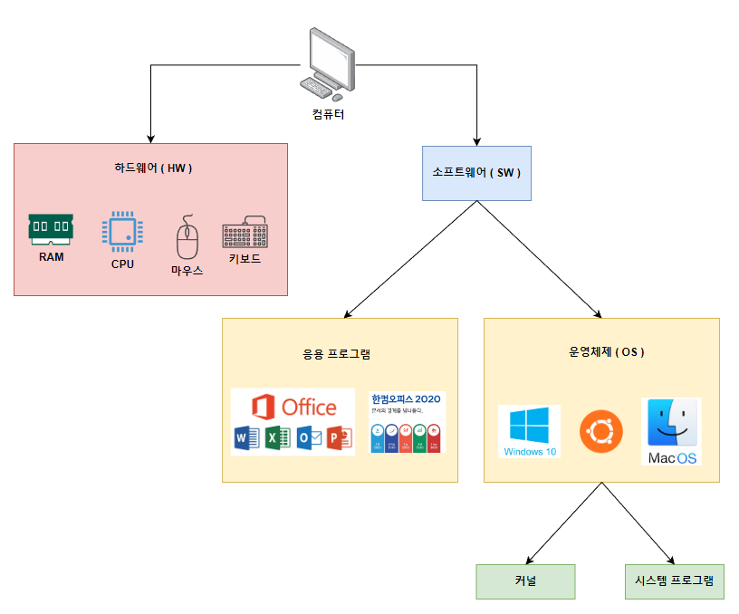
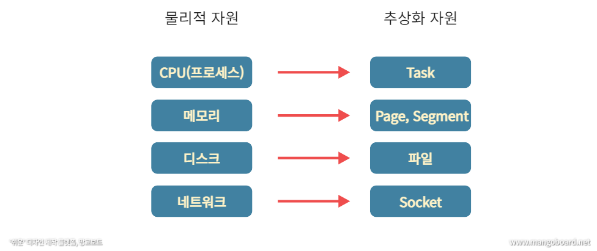
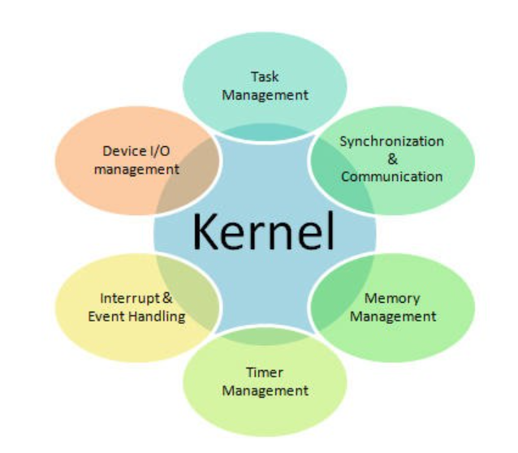
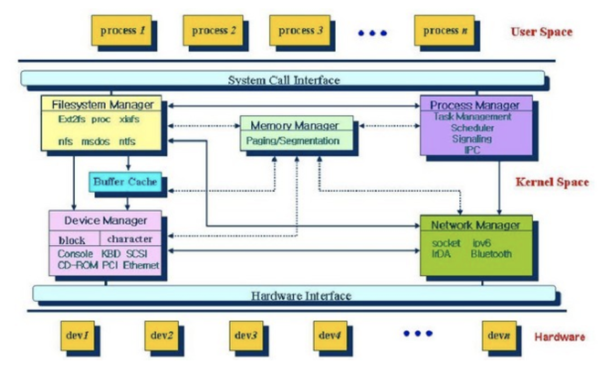

# 커널 ( Kernel )

> - 컴퓨터는 크게 2가지로 구분되는데
>   - 물리적으로 만질 수 있는 하드웨어 ( 모니터 , 키보드 , 컴퓨터 본체와 본체안에 있는 CPU, 메모리 등등)
>   - 물리적으로 존재하지 않는 소프트웨어
> - 소프트웨어는 운영체제 ( Linux,Window,MacOS 등 )와 그 위에 설치되는 프로그램인 응용 프로그램 ( Excel,Chrome 등 )으로 나눌 수 있다.
>   - 운영 체제는 커널( Kernel )과 시스템 프로그램으로 구분된다.

### 커널과 시스템 프로그램
- 커널은 운영체제의 핵심부분으로, 주로 디바이스 관리, 프로세스 관리, 메모리 관리, 시스템 콜 제공 같은 기능을 관리하는 등, 컴퓨터 자원을 관리
- 하지만 커널은 항상 컴퓨터 자원들만 바라보고 있어 사용자와 직접적인 상호 작용은 하지않음
- 그렇기 때문에 사용자와 상호작용을 하기 위해 필요한 것이 **시스템 프로그램 ( Shell )** 이다

### 커널의 역할

> - 커널의 가장 큰 목표는 컴퓨터의 물리적 ( 하드웨어 ) 자원과 추상화 자원을 관리하는 것
>   - 추상화 : 물리적으로 하나뿐인 하드웨어를 여러 사용자들이 번갈아 사용할 수 있도록 마치 여러개처럼 보이게 하는 기술
> - 물리적 자원인 하드웨어에 접근하기 위한 방법은 매우 복잡하고, 어려워 사용자가 직접 접근 하기에는 무리가있음
> - 그렇기 때문에, 물리적 자원을 추상화하여 사용자가 보다 쉽게 접근할 수 있도록 **"커널"** 이 필요하다.

### 커널의 자원 관리

- 커널은 물리적 자원과 추상화 자원들을 관리합니다.
- 따라서 리눅스 커널의 구성 요소는, 여러가지 자원들을 관리하는 관리자(Manager)라고 할 수 있습니다.
- 커널을 구성하는 자원 관리자들은 다음과 같다.
  - 태스크(Task) 관리자
    - 물리적 자원인 CPU를 추상적 자원인 Task로 제공
  - 메모리(Memory) 관리자
    - 물리적 자원인 메모리를 추상적 자원인 Page 또는 Segement로 제공
  - 파일 시스템(File System) 관리자
    - 물리적 자원인 디스크를 추상적 자원인 File로 제공
  - 네트워크(Network) 관리자
    - 물리적 자원인 네트워크 장치를 추상적 자원인 Socket으로 제공
  - 디바이스 드라이버(Device Driver) 관리자
    - 각종 외부 장치에 대한 접근
  - Interrupt Handling
    - 인터럽트 핸들러
  - I/O Communication
    - 입출력 통신 관리

> - 커널 구성요소들이 존재하는 공간을 Kernel Space라고 부른다.
> - Kernel Space위에 사용자로 여겨지는 태스크(그림의 Process)들이 존재하는 User Space가 있음
> - 우리가 아는 C/C++과 같은 컴퓨팅 언어로 작성된 프로그램 파일이 결국 task가 되는데,
> task를 사용자라고 생각하면됨 ( 태스크엔 사용자의 명령이 담겨져 있기 때문 )
> - Kernel Space와 User Space 사이에는 System Call Interface가 있다.
>   - User Space의 task들이 커널이 관리하는 자원에 접근해야할 일이 있으면, System Call Interface를 통해 Kernel Space의 자원 관리자에게 요청이 전달
>   - 그리고 이 커널의 각 자원 관리자는 사용자 요청에 맞게 알맞는 하드웨어에 사용자 명령을 전달하고 작업을 수행한다.
> - 즉 커널은 사용자가 System Call을 통해 컴퓨터 자원을 사용할 수 있게 해주는 자원 관리자 개념

