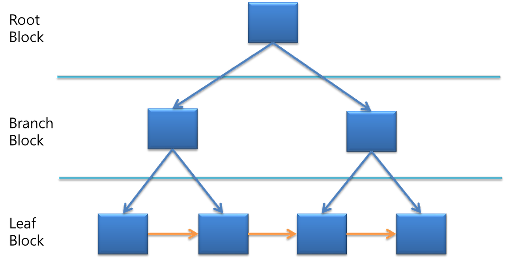

# Index

> - 인덱스는 데이터 검색속도 향상을 위하여 테이블에 저장된 로우(row)를 식별가능하도록 저장한 데이터베이스 오브젝트
> - 책에있는 목차,차례와 비슷한 개념으로, 목차부터 찾으면 원하는 정보가 몇페이지에 있는지 쉽게 찾을 수 있는 것과 같다.

## B* Tree 기반 인덱스
- 인덱스는 Balanced Tree 기반 인덱스로, Root 블록, Branch 블록 , Leaf 블록으로 구성
- Balanced Tree는 모든 Leaf 블록이 동일한 Depth를 유지하도록 하여 균형을 유지함
- 그러면 데이터 검색을 최대 Depth 이하로 하기 때문에, 검색 속도를 보장

- Leaf Block에서 주황색 선 부분이 있어, 검색을 옆으로 진행하여 매번 Root에서부터 내려올 필요가 없어 속도가 빨라짐.

## 인덱스 스캔 방식
1. Index Range Scan
   - 인덱스 루트블록에서 리프 블록까지 수직적으로 탐색한 후, 리프 블록을 필요한 범위만 스캔
2. Index Full Scan
   - 수직적 탐색 없이 인덱스 리프블록을 처음부터 끝까지 수평적으로 탐색하는 방식,
   - 대개는 데이터 검색을 위한 최적의 인덱스가 없을 때 차선으로 선택하는 방식,
   - 전체를 스캔하기보단 인덱스 스캔 단계에서 대부분 레코드를 필터링하고, 일부 테이블에 엑세스가 발생할 수 있다면 전체적인I/O 효율에서 유리
3. Index Unique Scan
   - 수직적 탐색만으로 데이터를 찾는 스캔방식, '=' 조건일 때만 동작
4. Index Skip Scan
   - 인덱스 선두컬럼이 조건전에 빠졋어도, 인덱스를 활용하는 스캔방식
   - 인덱스 선투컬럼의 Distinct Value 개수가 적고, 후행 컬럼의 Distinct Value 개수가 많을때 사용