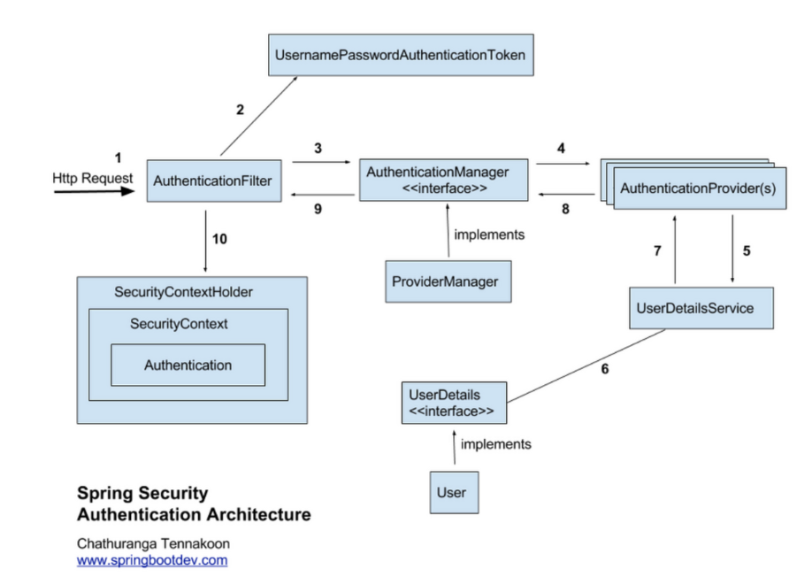

# Spring 이론
> Security 6.1 버전부터 Filter Chain과 Lambda 형식을 지향하는 방식으로 변경

## 기본 용어
- 인증 ( Authenticate ) - 접근한 사람을 확인 하는 절차
- 인가 ( Authorization ) - 인증된 사용자에 대해 권한을 확인하고 접근을 허락하는 것
- 접근 주체 ( Principal ) - 보호된 대상에 접근하는 유저

## Spring Security의 특징과 구조
- Filter 기반으로 동작하여 MVC와 분리하여 관리 및 동작
- 어노테이션을 이용한 간단한 설정
- 기본적으로 세션 & 쿠키 방식으로 인증
- 인증 관리자 ( Authentication Manager )와 접근 결정 관리자 ( Access Decision Manager )를 통해 사용자의 리소스 접근을 관리
- 인증 관리자는 UserNamePasswordAuthenticationFilter,접근 관리자는 FilterSecurityInterceptor가 수행한다

## 동작 원리

> 1. 사용자가 Form을 통해 로그인 정보를 입력하고 인증 요청을 보냄
> 2. AuthenticationFilter ( UserNamePasswordAuthenticationFilter )가 HttpServletRequest에서 사용자가 보낸 아이디와 패스워드를 인터셉트한다.
>   1. HttpServletRequest에서 꺼내온 사용자 아이디와 패스워드를 진짜 인증을 담당할 AuthenticationManger 인터페이스 ( ProviderManger )에게 인증용 객체 ( UsernamePasswordAuthenticationToken )으로 만들어 위임한다.
> 3. AuthenticationFilter에게 인증용 객체 ( UsernamePasswordAuthenticationToken )을 전달받는다.
> 4. 실제 인증을 할 AuthenticationProvider에게 Authentication 객체를 다시 전달
> 5. DB에서 사용자 인증 정보를 가져올 UserDetailsService 객체에게 사용자 아이디를 넘겨주고 DB에서 인증에 사용할 사용자 정보(사용자 아이디, 암호화된 패스워드, 권한 등)를 UserDetails(인증용 객체와 도메인 객체를 분리하지 않기 위해서 실제 사용되는 도메인 객체에 UserDetails를 상속하기도 한다.)라는 객체로 전달 받는다.
> 6. AuthenticationProvider는 UserDetails 객체를 전달 받은 이후 실제 사용자의 입력정보와 UserDetails 객체를 가지고 인증을 시도한다.
> 7. 인증이 완료되면 사용자 정보를 가진 Authentication 객체를 SecurityContextHolder에 담은 이후 AuthenticationSuccessHandle를 실행한다. (실패시 AuthenticationFailureHandler를 실행)

## Security Filter Chain  && AbstractHttpConfigurer
> - Spring 에서 모든 호출은 DispatcherServlet을 통과하게 되고, 이후에 각 요청을 담당하는 Controller로 분배된다.
> - 모든 요청들은 DispatcherServlet을 통과하기 이전에 Filter를 거치는데 이런 **Filter들의 묶음을 Filter Chain**이라고 하고,Filter는 주로 보호나 인증 ,권한 체크 등에 사용된다
> - 들어오는 요청을 필터링하고, HttpSecurity에 정의된 보안 구성을 적용한다. SecurityFilterChain은 들어오는 요청에 특정 순서로 적용

> - **AbstractHttpConfigurer**는 Spring 애플리케이션에서 HTTP 요청의 보안 구성을 담당하는 HttpSecurity 개체를 구성하는데 사용
> - 개발자가 인증,권한 부여, 세션 관리, CSRF 보호 등과 같은 HTTP 요청의 특정 부분을 구성할 수 있는 편리한 메서드 세트를 제공
> - **Abstract는 애플리케이션의 보안 설정을 구성하는데 사용하고, SecurityFilterChain은 이러한 보안 설정을 들어오는 요청에 적용하는데 사용한다.**

#
## 기본 설정 , 어노테이션 설명
1. @EnableWebSecurity
   2. Spring Security의 웹 보안 기능을 활성화시키고 Filter Chain을 자동으로 구성시켜주는 어노테이션
   3. WebSecurityConfigurer를 구현할 클래스를 스캔하고 이를 활성화함
