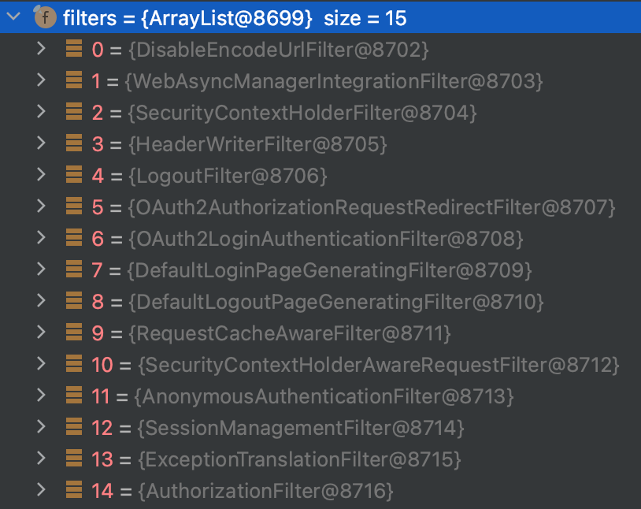

# Security OAuth2

### Spring Security Filter 구조
> 
> - 스프링 시큐리티와 스프링 OAuth2 Client 의존성을 추가하고, OAuth2 로그인 설정을하면 위처럼 필터 체인이 추가된다.
> - HTTP 요청이 들어오면 필터 -> 디스패처 서블릿 -> 인터셉터 -> 컨트롤러 순으로 요청이 전달되어 처리
> - **OAuth2 로그인 과정은 OAuth2AuthorizationRequestRedirectFilter 와 OAuth2LoginAuthenticationFilter 에서 처리**

### OAuth2 로그인 순서
> 1. 사용자가 소셜 로그인 버튼을 클릭
> 2. 백엔드에 로그인 주소를 요청 GET http://localhost:8080/oauth2/authorization/google ( redirect_uri 는 최근 프로퍼티 또는 yml 파일에 저장하는게 기본 redirect_uri 는 프론트엔드 주소)
> 3. 백엔드에서 소셜로그인 페이지 주소를 리턴 -> 소셜로그인 후 리다이렉트 주소를 백엔드로 설정
> 4. 소셜로그인 페이지가 출력
> 5. 사용자가 소셜로그인 페이지에서 로그인
> 6. 사용자가 로그인한 인가 코드를 요청, 인가 코드는 백엔드로 리다이렉트
> 7. 백엔드에서 인가코드로 액세스 토큰을 요청
> 8. 백엔드에서 액세스 토큰으로 리스소 서버에 사용자 정보를 요청
> 9. 리소스 서버로부터 받은 사용자 정보를 DB에 저장, 서비스 자체 엑세스 토큰과 리프레시 토큰을 생성, 리프레시 토큰을 DB에 저장
> 10. 액세스 토큰과 리프레시 토큰을 쿼리 스트링 또는 쿠키에 담아 프론트엔드로 리다이렉트
> 11. 액세스 토큰과 리다이렉트 토큰을 쿠키 또는 로컬 스토리지에 저장
>     - 최근 추세는 로컬스토리지가아닌 HttpOnly, Secure 접두사를 붙힌 시큐어 쿠키 자체를 주고받는 방식을 선호
>     - 로컬 스토리지의 경우 XSS에 취약하여 탈취의 위험이 높음

### OAuth2AuthorizationRequestRedirectFilter
> - 최초 프론트엔드에서 백엔드에 로그인 주소를 요청하고, 백엔드에서 로그인 페이지를 리턴하는 부분을 담당
> - ex) GET http://localhost:8080/oauth2/authorization/google 로 요청이 들어오면 해당 필터에서 요청을 처리
> - OAuth2AuthorizationRequestRedirectFilter 객체의 resolve 메서드를 호출하여 요청 URL과 파라미터를 검사하여
> 특정 조건에 일치하면 OAuth2AuthorizationReqeust 객체를 생성하여 리턴
