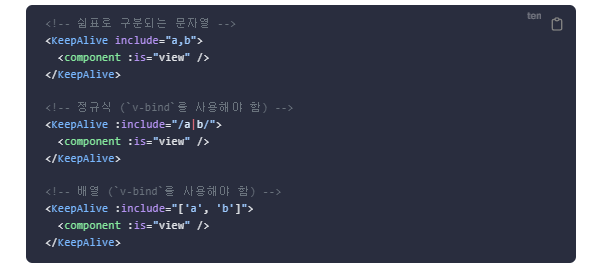
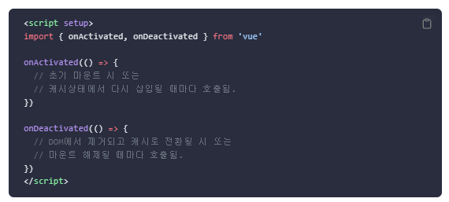

# KeepAlive

- Vue3에서 기본적으로 활성 컴포넌트 인스턴스는 전활할 때 마운트가 해제 된다.
- 이렇게 하면 해당 컴포넌트가 보유한 모든 상태가 손실됩니다.
- 이 컴포넌트가 다시 표시되면 초기 상태로만 새 인스턴스가 생성되기 때문에 기존에 출력되거나 입력했던 정보가 모두 사라지게 된다.
- 그래서 **이전 페이지나 입력 데이터를 저장해야하는 일이 발생할때를 위해 생긴 컴포넌트가 바로 KeepAlive이다.**

#
#
### 캐싱 선언
- KeepAlive는 내부의 모든 컴포넌트를 캐시하는데, include 및 exclude Props를 통하여 이 동작을 사용자 정의 할 수 있다.

> 
- 컴포넌트에서 설정해놓은 name 값과 일치하는지 확인하기 때문에 캐시되어야 하는 컴포넌트는 명시적으로 name 옵션을 선언해줘야 한다.

#
#
### 생명주기

- KeepAlive 컴포넌트는 onActivated() , onDeactivated()를 사용하여 이 두가지 상태에 대해 생명주기 훅을 등록 할 수 있다.
  - onActivated는 마운트 해제시에도 호출되고 , onDeactivated는 마운드 해제시에도 호출된다
  - 두 훅은 KeppAlive에 의해 캐시된 루트 컴포넌트 뿐 아닌 캐시된 트리 내의 하위 컴포넌트에도 작동한다.
> 

